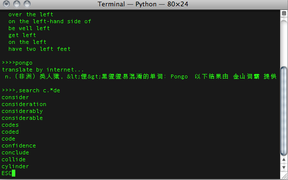

zjdict 命令行字典
=========================

**a command line word dictionary**

# Function 功能 #
* green application 绿色软件 无需安装 解压即用

* new word file as text format 文本格式生词本

* command user interface 命令行交互

* local dictionary. 离线词典
	you can translate word by local _startdict_ dictionary 
	本地使用星际译王词典

* translate on line. 在线翻译
	support baidu online translate and youdao online translate.
	支持百度词典，有道词典在线翻译

* mode 多模式
	translate mode 翻译模式
	search mode 查找模式

* matching 匹配方式
	regular expression 支持正则表达式

# snapshot 截图#

![alt="translate翻译] (zjdict_translate.png)

# command 命令#
	
* **,save** save to 'new word' file保存至生词本

* **,search &lt;regular&gt;** 查找

* **,search** search mode 查找模式

* **,quit** or **,exit** exit 退出

# develop 开发#
* source code 源代码
	+ [@github](http://github.com/codepongo/zjdict) the newest
	+ [@googlecode](http://utocode.googlecode.com/svn/trunk/zjdict/) mirror

* third party library 第三方库
	+ pystardict 
	[@sourceforge](http://sourceforge.net/projects/pystardict)
	[@github](https://github.com/lig/pystardict)
	+ getch
